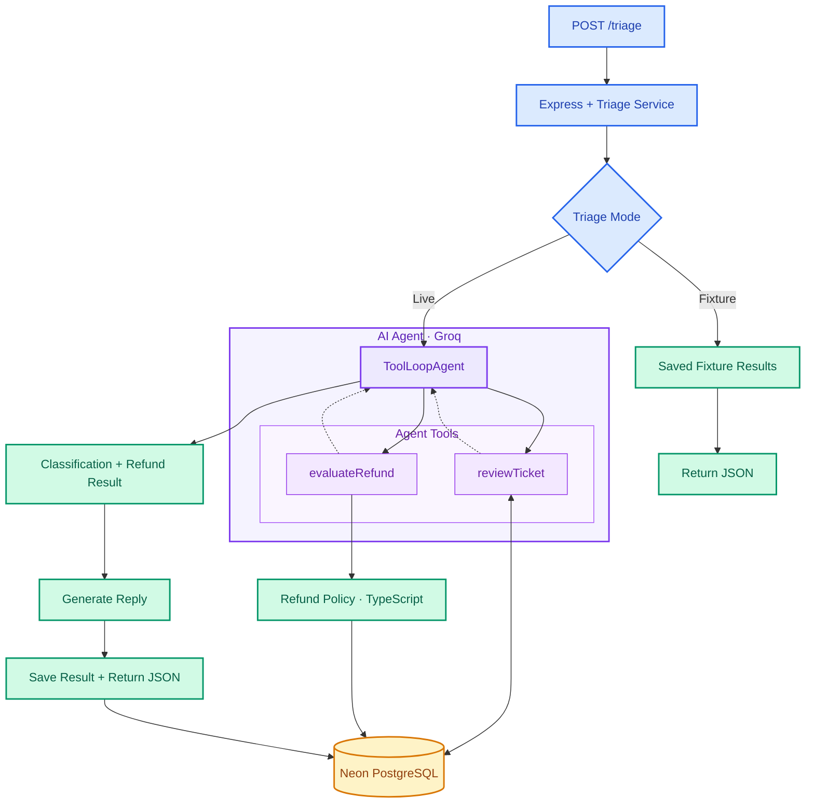

# Dhaba Support Ticket Triage

A customer support triage API built with TypeScript, Express, and the Vercel AI SDK.

The system classifies support tickets, evaluates refund eligibility, generates reply drafts, and identifies tickets that require human review.

## Tech Stack

- **Backend:** Node.js, TypeScript, Express
- **AI:** Vercel AI SDK (`ToolLoopAgent`), Groq (`openai/gpt-oss-20b`)
- **Database:** Neon PostgreSQL, Drizzle ORM
- **Validation:** Zod

## Setup

Install dependencies:

```bash
npm install
```

Create a `.env` file in the project root.

**Live mode:**

```env
PORT=8000
DATABASE_URL=your_neon_connection_string
GROQ_API_KEY=your_groq_api_key
TRIAGE_MODE=live
```

**Fixture mode (no API keys required):**

```env
PORT=8000
TRIAGE_MODE=fixture
```

## Running the Project

Start the server:

```bash
npm run dev
```

The API runs on port `8000` by default.

In another terminal, run the provided ticket fixtures:

```bash
npm run replay
```

The replay script sends all 12 tickets to the API and prints their classification, severity, refund decision, human escalation status, and confidence.

### Live Mode

Set `TRIAGE_MODE=live` to process tickets using Groq, the AI agent, and PostgreSQL.

For initial database setup:

```bash
npm run db:push
```

### Fixture Mode

Set `TRIAGE_MODE=fixture` to replay tickets without a Groq API key or database credentials.

This mode uses saved classification data and reply drafts instead of making live AI requests. It is intended to let evaluators inspect the workflow without consuming API tokens.

## API

### POST `/triage`

Accepts a customer support ticket containing its subject, body, purchase history, and app usage information.

Returns:

```json
{
  "category": "billing",
  "severity": "high",
  "refund": {
    "approved": false,
    "amount": 0,
    "reason": "Payment dispute requires human review."
  },
  "reply_draft": "Our support team will review the charge.",
  "needs_human": true,
  "confidence": 0.9
}
```

The example above is illustrative.

## How It Works

1. The incoming ticket is validated using Zod.
2. `ToolLoopAgent` classifies the ticket and decides whether tools are needed.
3. `reviewTicket` retrieves ticket and purchase information.
4. `evaluateRefund` applies the backend refund policy.
5. The system generates a customer reply draft.
6. The final result is saved to PostgreSQL.

Completed tickets are cached by ticket ID to avoid duplicate processing.

In fixture mode, the system bypasses the live AI and database workflow.

## Flow Diagram





## Refund Policy

Refund eligibility is evaluated using TypeScript rules, not decided directly by the AI model.

A standard refund can be automatically approved when:

- A successful renewal exists.
- The renewal is within the assumed seven-day eligibility period.
- The customer has not opened the app since renewal.

Disputed or unauthorized charges require human review.

Approval indicates eligibility under the implemented policy. It does not mean a refund has actually been issued.

The seven-day window is an assumption made for this assignment.

## Reliability and Safety

- Zod validates incoming tickets and AI output.
- Customer messages are treated as untrusted input.
- Refund decisions are controlled by backend logic.
- Failed or uncertain refund evaluations do not result in automatic approval.
- Human review is required for disputes and cases needing investigation.
- Reply generation includes safeguards against unsupported claims.
- Database transactions keep ticket and refund records consistent.

## Tradeoffs

- **ToolLoopAgent:** Simplifies tool calling, but model behavior can vary between runs.
- **Deterministic refunds:** Easier to audit and test, but policy changes require code updates.
- **Separate classification schema:** Keeps AI interpretation separate from final backend decisions.
- **Fixture mode:** Runs without external credentials, but does not test live AI behavior.
- **Generated replies:** Flexible, but may still require human review for factual accuracy.

## AI Usage

The development process, AI assistance, and issues caught during testing are documented separately in `AI_USAGE.md`.